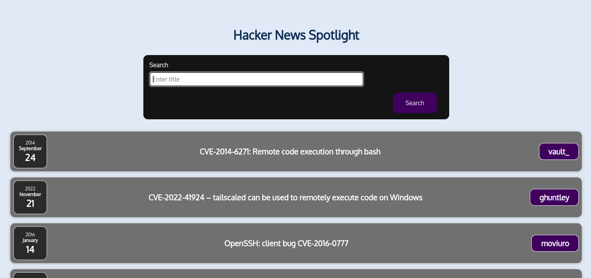

# Hacker News Spotlight

## Steps to Run

1. Clone the repository: `git clone https://github.com/wilsonwahome/hacker-news-spotlight.git`
2. Navigate to the project directory: `cd hacker-news-spotlight`
3. Install dependencies: `npm install`
4. Start the development server: `npm start`
5. Open your browser and go to `http://localhost:3000` to view the app.

## Technologies Used

- React
- React Router
- Axios
- Hacker News API